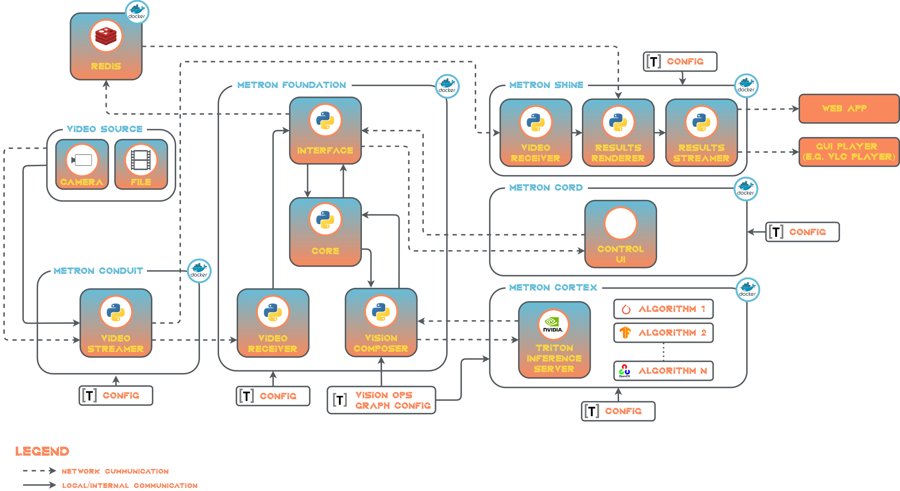

# Architecture

## Architectural Decisions
The solution aims to handle **single** camera video stream which could come from various data sources (USB, IP camera).
Therefore, there is **no multi-streams** load balancing. Execution logic is Python-based combined with computer 
vision inference runtime engine. By mature of the solution, solution **does not handle results saving** (e.g. into 
database), only visual displaying.

## Architecture Description
A reference architecture is based on *Linux* OS running on *x86* *desktop/laptop machine*.

The solution is consisted of five components.

### Metron Conduit
Metron Conduit represents an input of the solution. As its name suggests, it transmits source video stream over network 
to other Metron's components. Video file (TODO: formats) or camera (IP/USB) can be used. Component is based on 
Python 3 and uses *VideoGear* and *NetGear* of [vidgear](https://abhitronix.github.io/vidgear/latest/) 
framework. It sends two streams. The first high quality stream is used for computer vision and the second one, with 
lower resolution and bitrate, is used for results rendering. 

For detailed description, take a look on [Metron Conduit README](../metron_conduit/metron_conduit_readme.md).

