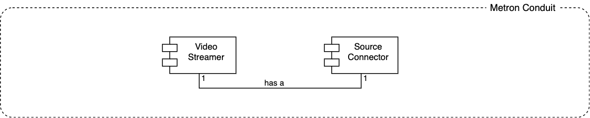
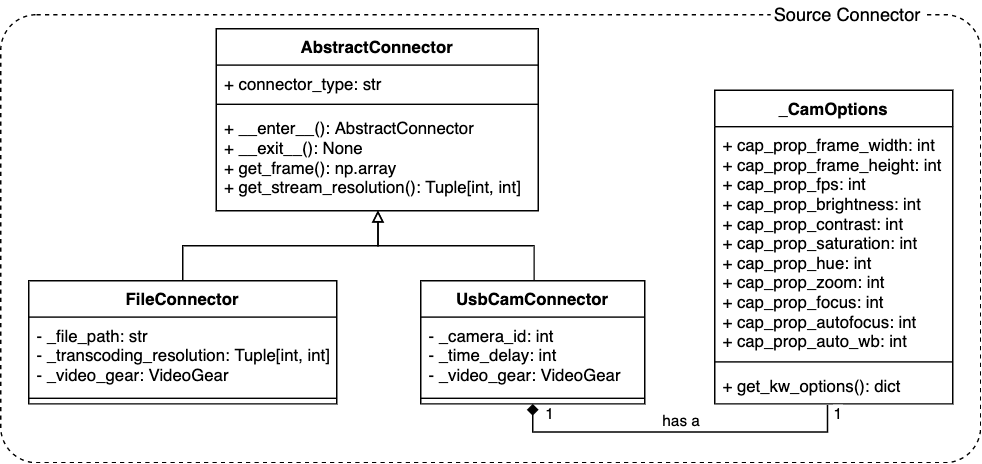
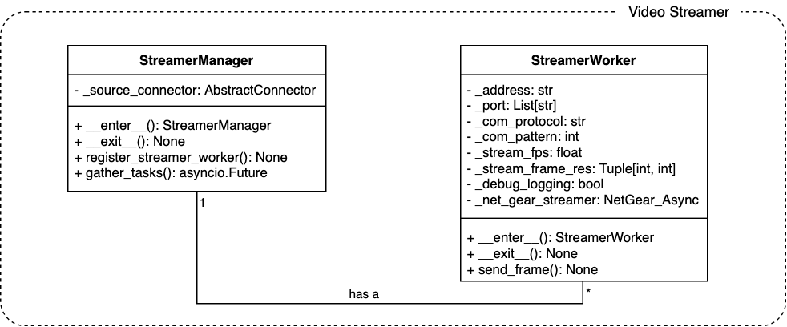

# Metron Conduit

[comment]: <> (Description paragraph is taken from architecture.md)
Metron Conduit represents an input of the solution. As its name suggests, it transmits source video stream over network
to other Metron's components. Video file (all major containers and formats) or camera (IP/USB) can be used. Component is
based on Python 3 and uses *VideoGear* and *NetGear* of [vidgear](https://abhitronix.github.io/vidgear/latest/)
framework. It sends two streams. The first high quality stream is used for computer vision and the second one, with
lower resolution and bitrate, is used for results rendering.

## Configuration

Metron Conduit's configuration files are located in `metron_conduit/conf` folder. Component's configuration is based on
Facebook's [Hydra](https://hydra.cc) configuration framework, which is consisted of YAML files structured in folders.
Please read [Hydra docs](https://hydra.cc/docs/1.0/intro) to better understand configuration process, structure of
config files, etc...

**To run Metron Conduit, there must be no missing configuration parameters in the composed Hydra config object, see
[Running Commands](#running-commands) section. Config parameters which are missing and have to be defined by user are
highlighted via :pencil2::heavy_exclamation_mark:. Other config parameters are preset and do not need to be changed to
make it run.**

Root config file `metron_conduit_config.yaml`:

- `source_connector`: Defines Source Connector type. It is a value
  of `source_connector` [config group](https://hydra.cc/docs/1.0/tutorials/basic/your_first_app/config_groups). Allowed
  values are `usb_cam_source` or `file_source`.

If `file_source` selected, `source_connector/file_source.yaml`:

- :pencil2::heavy_exclamation_mark: `file_path`: Path to video file used as an input video stream.
- :pencil2::heavy_exclamation_mark: `transcoding_resolution`: List of two int values. The first number defines video
  stream width, the second video stream height. The resolution does not have to match with native video file resolution.
  The resolution for stream is upscaled or downscaled, based on the transcoding resolution value.

If `usb_cam_source` selected, `source_connector/usb_cam_source.yaml`

- :pencil2::heavy_exclamation_mark: `camera_id`: Camera id to be used as a source of video stream. Camera id is defined
  by host OS. It is an integer number. Use `O`, for systems with one attached camera. Use `O` or `1` or systems with two
  attached cameras.
- :pencil2::heavy_exclamation_mark: `cam_frame_res`: List of two int values. The first number defines video stream
  width, the second video stream height. Defines camera stream resolution. It does not need to be camera native
  resolution, but has to be supported one.
- `cam_fps`: Video stream FPS. Has to be integer in range (0, 60>.
- `time_delay`: Number of seconds (integer) before camera stars streaming. Time delay could be called as a warm-up
  process, during which camera gets adapted - autofocus, color balancing, etc...
- `cam_brightness`: Sets camera brightness, if supported by a platform. *Currently it is not supported on MacOS.*
  Value has to be integer in range <0, 100>. If parameter is not set, camera's default setup is used.
- `cam_contrast`: Sets camera contrast, if supported by a platform. *Currently it is not supported on MacOS.*
  Value has to be integer in range <0, 100>. If parameter is not set, camera's default setup is used.
- `cam_saturation`: Sets camera saturation, if supported by a platform. *Currently it is not supported on MacOS.*
  Value has to be integer in range <0, 100>. If parameter is not set, camera's default setup is used.
- `cam_hue`: Sets camera hue, if supported by a platform. *Currently it is not supported on MacOS.*
  Value has to be integer in range <0, 100>. If parameter is not set, camera's default setup is used.
- `cam_zoom`: Sets camera saturation, if supported by a platform. *Currently it is not supported on MacOS.*
  Value has to be integer in range <-100, 100>. If parameter is not set, camera's default setup is used.
- `cam_focus`: Sets camera focus, if supported by a platform. *Currently it is not supported on MacOS.*
  Value has to be integer in range <0, 255>. If parameter is not set, camera's default setup is used.
- `cam_autofocus`: Sets camera autofocus, if supported by a platform. *Currently it is not supported on MacOS.*
  Value has to be `0` to turn off autofocus or `1` to turn on. If parameter is not set, camera's default setup is used.
- `cam_auto_wb`: Sets camera auto white balance, if supported by a platform. *Currently it is not supported on MacOS.*
  Value has to be `0` to turn off autofocus or `1` to turn on. If parameter is not set, camera's default setup is used.

`video_streamer/mcore_streamer_worker.yaml` (overriding base configuration
from `video_streamer/base_streamer_worker. yaml`):

- :pencil2::heavy_exclamation_mark: `stream_frame_res`: Streaming resolution to Metron Core which does not need to
  correspond with resolution defined in `source_connector`. If resolution is corresponding to to resolution
  in `source_connector` configuration, then no resolution transcoding is performed, otherwise stream frames upsampling /
  downsampling is performed. List of two int values.
  *It is recommended to use higher resolution.* The first number defines video stream width, the second video stream
  height.
- `stream_fps`: Defines FPS of stream to Metron Core. It does not need to match with FPS defined in `source_connector`.
  It is recommended to use much lower FPS, because the stream is used for computer vision which implies possibility of
  computational power bottleneck. Value is float in range (0, 60>. Value below 1 means that one video frame will be
  broadcasted per several seconds. *The recommended range is between 0.5 and 5.*
- `address`: IP/domain address of Metron Conduit host. String representation.
- `port`: Port on which streaming to Metron Core is served. String representation.
- `com_protocol`: Async NetGear
  [communication protocol type](https://abhitronix.github.io/vidgear/latest/gears/netgear_async/params/#protocol). Value
  is `"tcp"` or `"ipc"`.
- `com_pattern`: Asnyc NetGear
  [communication pattern type](https://abhitronix.github.io/vidgear/latest/gears/netgear_async/params/#pattern). Value
  is one of `0`, `1`, `2` or `3` options.

`video_streamer/mshine_streamer_worker.yaml` (overriding base configuration
from `video_streamer/base_streamer_worker. yaml`):

- :pencil2::heavy_exclamation_mark: `stream_frame_res`: Streaming resolution to Metron Shine which does not need to
  correspond with resolution defined in `source_connector`. If resolution is corresponding to to resolution
  in `source_connector` configuration, then no resolution transcoding is performed, otherwise stream frames upsampling /
  downsampling is performed. List of two int values.
  *It is recommended to use lower resolution.* The first number defines video stream width, the second video stream
  height.
- `stream_fps`: Defines FPS of stream to Metron Shine. It does not need to match with FPS defined in
  `source_connector`. It is recommended to use modest framerate for displaying purposes. Value is float in range (0, 60>
  . Value below 1 means that one video frame will be broadcasted per several seconds. *The recommended range is between
  10 and 30.*
- `address`: IP/domain address of Metron Conduit host. String representation.
- `port`: Port on which streaming to Metron Shine is served. String representation.
- `com_protocol`: Async NetGear
  [communication protocol type](https://abhitronix.github.io/vidgear/latest/gears/netgear_async/params/#protocol). Value
  is `"tcp"` or `"ipc"`.
- `com_pattern`: Asnyc NetGear
  [communication pattern type](https://abhitronix.github.io/vidgear/latest/gears/netgear_async/params/#pattern). Value
  is one of `0`, `1`, `2` or `3` options.

## Demo App

Metron Conduit provides a demo application to showcase how it works and quickly test if it works correctly on a host
system.

> ##### :warning: Attention :exclamation: :raised_hands: :exclamation:
> Demo uses ports `13100` and `13101`. If ports are already in use, change them to different ones.

Open a terminal / cmd, go into Metron's root folder and run following commands:

```shell
cd metron_conduit
docker-compose -f docker-compose.conduit-demo.yml --env-file .env.conduit.demo  build
```

When the building process is completed, deploy the demo application:

```shell
docker-compose -f docker-compose.conduit-demo.yml --env-file .env.conduit.demo up
```

When Metron Conduit is loaded, you should see rapidly increasing logs from `metron_conduit` and
`metron_conduit_receiver_demo` services, like this:

```shell
metron_conduit                  | 13:23:36 :: NetGear_Async :: DEBUG :: [b'Message Received!']
metron_conduit                  | 13:23:36 :: NetGear_Async :: DEBUG :: [b'Message Received!']
metron_conduit                  | 13:23:37 :: NetGear_Async :: DEBUG :: [b'Message Received!']
metron_conduit_receiver_demo    |   [0 0 0]]]
metron_conduit_receiver_demo    | [[[0 0 0]
metron_conduit_receiver_demo    |   [0 0 0]
metron_conduit_receiver_demo    |   [0 0 0]
metron_conduit_receiver_demo    |   ...

```

This means the demo is working correctly, frames of a demo video file are broadcasted by Metron Conduit and consumed by
another service.

To run the receiver application on the host in parallel and visualize the stream, open a new terminal, go to Metron's
root folder and run following command:

> ##### :warning: Attention :exclamation: :raised_hands: :exclamation:
> To run the receiver application on the host, all Metron's dependencies have to be installed on a bare metal or in
> a virtual environment and the virtual environment has to attached into the console.
> See [Development Installation: Option 2](../docs/project_installation.md#option-2-using-bare-metal)
>
> It is not possible to run receiver application on a host with Windows.

```shell
python demo/metron_conduit_receiver.py -t docker_host -p 13101
```

In case you changed the ports, use the corresponding one. You should should see the stream now.

To stop demo application, press Ctrl+C and to shut down run following command:

```shell
docker-compose -f docker-compose.conduit-demo.yml --env-file .env.conduit.demo down
```

## Running Commands

Based on used installation type (see [project installation guide](../docs/project_installation.md#)), use one of the
following ways.

### End User Installation - Docker Compose

Section [End User Installation: Docker Compose](../docs/project_installation.md#docker-compose)
describes how to start Metron.

**Only Metron Conduit Docker Compose configuration options highlighted by
:pencil2::heavy_exclamation_mark: can be customized to start Metron with default deployment Docker Compose setup.**

`.env` defines following Metron Conduit config options:

- `METRON_SHINE_HOSTNAME`: Hostname or IP where Metron Shine is running.
- `METRON_SHINE_STREAM_PORT`: Port on which the streaming to Metron Shine is performed. *Default configuration uses
  port `13101`. If the port is already in usage, change it to different one.*
- `METRON_CORE_HOSTNAME`: Hostname or IP where Metron Core is running.
- `METRON_CORE_STREAM_PORT`: Port on which the streaming to Metron Core is performed. *Default configuration uses
  port `13100`. If the port is already in usage, change it to different one.*
- :pencil2::heavy_exclamation_mark: `METRON_CONDUIT_CMD_CONFIG_ARGS`: Defines command line configuration arguments for
  Metron Conduit start script `metron_conduit_run.py`. **To start the application, missing configuration parameters have
  to be defined. See [configuration section](#configuration)**.

#### :pencil2::heavy_exclamation_mark: Attach Physical Camera to Metron Conduit

> ##### :warning: Attention :exclamation: :raised_hands: :exclamation:
> Camera device Docker mapping works on Linux. It does not work on Windows nor MacOS. There is a
> [workaround guide](https://medium.com/@jijupax/connect-the-webcam-to-docker-on-mac-or-windows-51d894c44468) which
> might work, but it is not guaranteed nor tested.

By default, Docker does not attach external devices, as a physical camera is, and it is required to attach the camera
manually. In `docker-compose.override.yml`, under section `services` there is a section `metron_conduit` with commented
section called `devices`. Uncomment the section and modify camera ids. The part before column defines which host camera
device is taken. The part after column defines camera device mapping inside Metron Conduit container. Camera mapping on
a host machine starts with 0. If the host machine has an embedded camera, 0 is dedicated for it, and an external USB
camera is mapped to 1. Mapping in the container should follow the same logic. *Use container internal camera mapping id
as* `camera_id` *value for* `usb_cam_source` *configuration option, if chosen.*

#### :pencil2::heavy_exclamation_mark: Attach Video File to Metron Conduit

To use a video file as an input source, the file has to be visible inside Docker container. It is needed to mount an
external folder to the container, to make the file visible. Multiple files could be located in the mounted folder.
In `docker-compose.override.yml`, under section `services` there is a section `metron_conduit` with commented section
called `volumes`. Uncomment the section and modify. The part before column defines host machine folder location. The
part after column defines container internal path where the folder will be mounted. *Container internal path has to be
used to specify video file location value for* `file_path` *in* `file_source` *configuration option, if chosen.*

### Development Installation - Option 2

In attached virtual environment, go to Metron Conduit directory:

```shell
cd metron_conduit
```

Use following command to start the application:

```shell
python metron_conduit_run.py
```

**To start the application, missing configuration parameters have to be defined.
See [configuration section](#configuration)**. It is recommended to get familiar
with [Hydra docs](https://hydra.cc/docs/1.0/intro) to understand how to define them. Basically, missing parameters can
be directly defined in config files or defined during application start as a part of the previous command.

By default *only INFO logging level* is turned on. To turn on *DEBUG logging level* pass `hydra.verbose=true` during the
application start. Run command will look like this:

```shell
python metron_conduit_run.py hydra.verbose=true
```

## Architecture

Metron Conduit is consisted of following major modules:

- **Source Connector**: A connector to particular video source type. So far, there exist connectors to video file and
  USB camera.
- **Video Streamer**: It sends video stream frames of particular Source Connector to Metron Foundation and Metron Shine
  components. Stream heading into Metron Foundation is quality lossless stream, whereas Metron Shine stream uses lossy
  compression. In general, it supports multiple streams, not only two.

Modules relationship could be visualized using class diagram:


### Source Connector

Module is located in `metron_conduit/source_connector`.


*Image: Class diagram*

`AbstractConnector.connector_type` is an abstract attribute and has to be implemented for every inherited class and
defines label for particular Source Connector type.

### Video Streamer

Module is located in `metron_conduit/video_streamer`.


*Image: Class diagram*

## Benchmarking

CPU Intel Core-i7 6850K@3.6/4.1GHz (6c/12t) was used for the benchmarking. It was measured CPU usage for two streams
broadcasting - Metron Core stream and Metron Shine stream. Streams were received on another machine in LAN. 
Resolution and FPS was identical for both streams.

| Resolution | FPS | CPU Usage (Threads) |
|------------|-----|---------------------|
| 1280x720   | 30  | 1                   | 
| 1920x1080  | 15  | 1.5                 |
| 3840x2160  | 5   | 1.5                 | 
